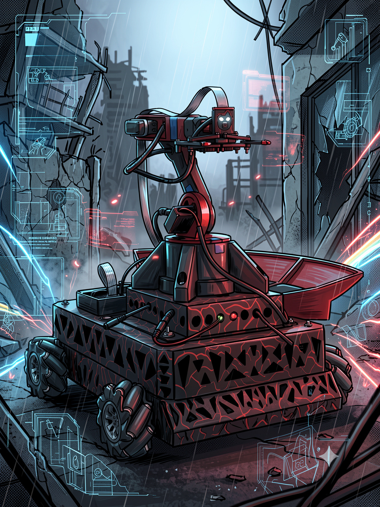
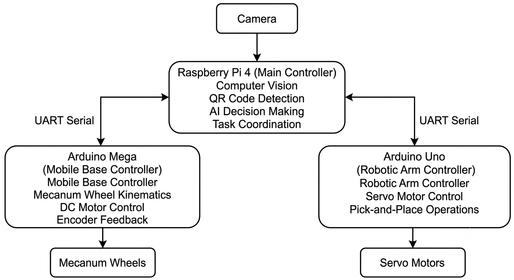
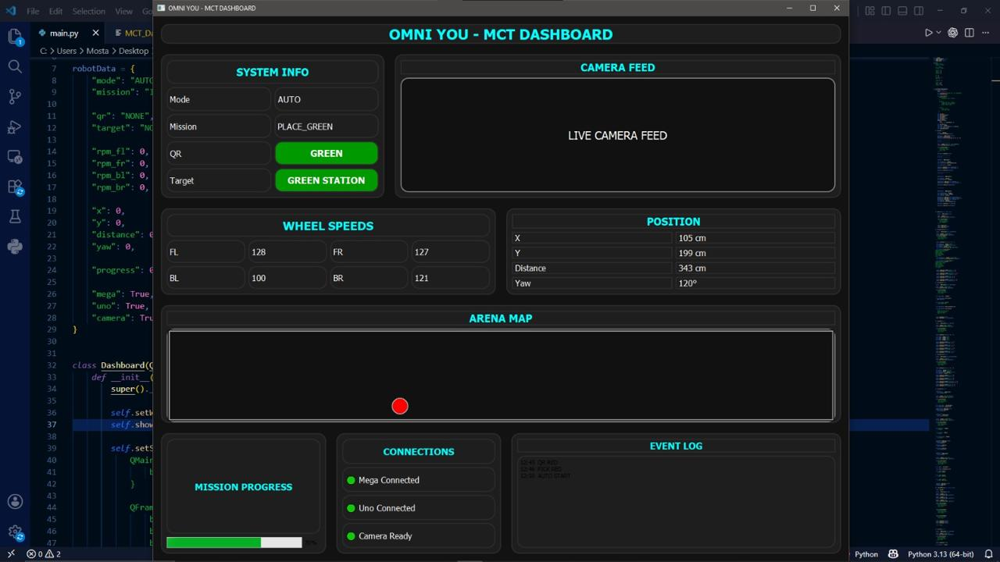

  
  
  

<h1 align="center">🤖 OMNI YOU - Autonomous Omni-Directional Robot</h1>

Autonomous omnidirectional robot capable of QR-based object detection, robotic pick-and-place, and real-time monitoring using Raspberry Pi and Arduino.

---

## 📖 Project Overview

OMNI YOU is an autonomous omni-directional mobile robot designed to perform QR-based pick-and-place tasks with high accuracy.

The robot uses a Raspberry Pi for computer vision and decision making, Arduino Mega for mobile base control, and Arduino Uno for robotic arm control. A real-time HMI dashboard allows monitoring and manual control of the entire system.

The project was developed for a robotics competition where it successfully achieved **🥇 First Place**.

## ✨ Key Features

- 🔍 QR Code Detection using OpenCV
- 🤖 Autonomous Navigation
- 🦾 4-DOF Robotic Arm
- 📦 Automatic Pick & Place
- 🎮 Omni-directional Mecanum Drive
- 🖥️ Real-Time HMI Dashboard
- 🔗 Distributed Raspberry Pi + Arduino Architecture
- 📷 Live Camera Streaming
- ⚡ Real-Time Serial Communication

- ---

## 🏗️ System Architecture

The system is built on a distributed architecture where each controller is responsible for a specific task. The Raspberry Pi acts as the main controller, coordinating computer vision and communication between the mobile base and the robotic arm.

  

###

- **Raspberry Pi 4**
  - Computer Vision
  - QR Code Detection
  - Task Coordination
  - Decision Making

- **Arduino Mega**
  - Mobile Base Control
  - Mecanum Wheel Kinematics
  - DC Motor Control
  - Encoder Feedback

- **Arduino Uno**
  - Robotic Arm Control
  - Servo Motor Control
  - Pick-and-Place Operations

- **Camera**
  - Captures images for QR code detection.

- **UART Serial Communication**
  - Enables real-time communication between Raspberry Pi, Arduino Mega, and Arduino Uno.
 
- ---

## 🖥️ HMI Dashboard

The robot can be monitored and controlled through a real-time desktop dashboard developed using PyQt5.

  

---

# 🚀 Future Work

- ROS2 Integration
- SLAM
- YOLOv11 Object Detection
- Path Planning
- AI Task Scheduling
- Cloud Dashboard
- Voice Commands
- Multi-Robot Coordination
- Digital Twin
- Web Dashboard

---

# 👨‍💻 Credits

Developed by Team 6

Faculty of Engineering

Ain Shams University

Mechatronic System Design
